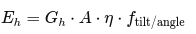

# Prognosemodell mit Wetterdaten

Diverse Plattformen bieten eine Unterstützung bei der Prognose von Wetter an und liefern dazu - je nach Plattform - unterschiedliche Attribute mit Prognosemöglichkeit bis zu 7 Tagen.

In diesem Projekt wird das API von open-meteo.com verwendet, welches eine Fülle von Attributen anbietet. Für dieses Projekt wird folgende Konstellation verwendet:

"https://api.open-meteo.com/v1/forecast?"
  "latitude=48.411&longitude=13.5395"
  "&hourly=cloudcover,shortwave_radiation,precipitation,sunshine_duration"
  "&timezone=Europe%2FBerlin&forecast_days=2";

## Konzeptionelle Bausteine

* **Input (stündlich)** : shortwave_radiation (W/m²), cloudcover (%), precipitation (mm), sunshine_duration (s), ggf. SoC (State of Charge), gewünschte Mindestreserve (kWh), PV-Fläche & Effizienz, Längs-/Breitengrad
* **Erwartete Erzeugung pro Stunde** : 
  Energie (shortwave_radiation) * Modulfläche * Unsicherheitsfaktor * Azimuth/Dachneigung (Wirkungsgrad, der sich aus Azimuth und Dachneigung zusammensetzt)
* **Unsicherheits-/Risikoabschätzung** : Verwende einfache Proxy-Unsicherheit aus z. B. cloudcover-Level (mehr Wolken → größere Varianz) oder historische Forecast-Fehler für deinen Standort.
* **Nutzenfunktion / Score** : Kombiniere erwartete Erzeugung, Unsicherheit, Batterie-Zustand und Prioritäten (z. B. Reserve vs. Effizienz).
* **Zeitfensterwahl** : Wähle die minimal nötigen Stunden mit höchsten Scores, sodass benötigte Energie erreicht wird (oder schalte Relais nach Priorität).
* **Adaptivität** : Aktualisiere Strategie stündlich oder alle X Stunden mit neuen Forecasts.

Wir haben vier relevante Prognosewerte von  **open-meteo** :

* **cloudcover [%]** → Maß für die Bewölkung
* **precipitation [mm]** → Niederschlag, Hinweis auf unsicheres / schlechtes Wetter
* **sunshine_duration [s]** → effektive Sonnenscheindauer pro Stunde
* **shortwave_radiation G [W/m²]** → Strahlungsleistung (entscheidend für PV-Ertrag)
